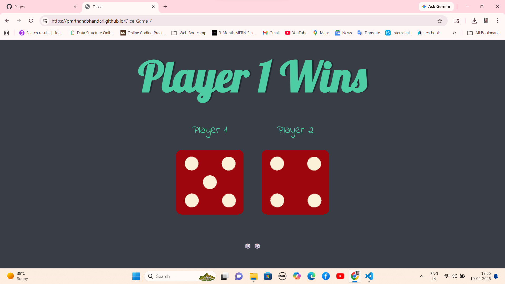
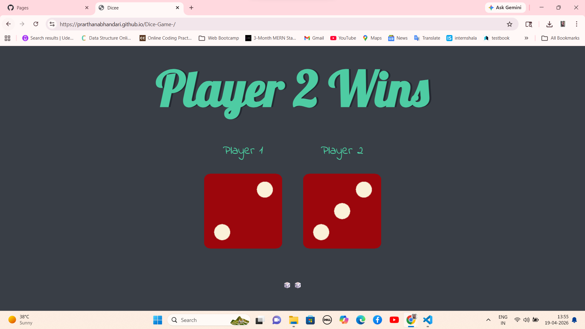
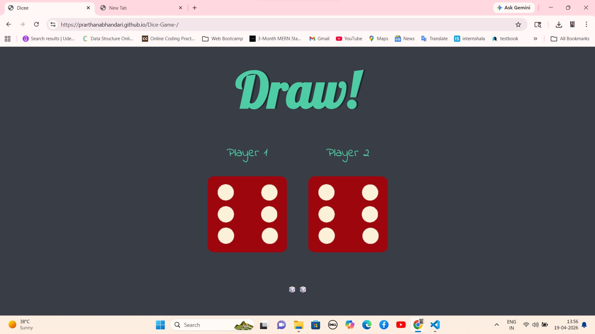

# 🎲 Dice Game


---

## 🌍 Overview

**Dice Game** is a simple and interactive web-based game built using **HTML, CSS, and JavaScript**.

The game simulates rolling two dice for two players. Each time the page is refreshed, new random dice values are generated and the winner is displayed automatically.

---

## 🎯 Purpose of This Project

This project was created to:

- Understand **JavaScript DOM manipulation**
- Practice **random number generation**
- Learn how to **update UI dynamically**
- Build logic-based mini games
- Strengthen frontend development skills

---

## 🚀 Features

- 🎲 Random dice roll generation  
- 👤 Two-player system  
- 🏆 Automatic winner detection  
- 🔄 Refresh to play again  
- 🎨 Simple and clean UI  
- ⚡ Fast and lightweight  

---

## 🛠️ Tech Stack

| Technology | Usage |
|----------|------|
| HTML | Structure |
| CSS | Styling |
| JavaScript | Game Logic |

---

## 📂 Project Structure

```bash
Dice-Game/
│
├── images/              # Dice images (dice1.png to dice6.png)
├── index.html           # Main HTML file
├── style.css            # Styling file
├── index.js             # Game logic
├── README.md            # Documentation
└── .gitignore
```

---

## 🎥 Demo / Preview

👉 *(You can add your video link here)*

```
https://your-demo-link.com
```

---

## 📸 Screenshots

### 🎮 Game Interface






> 📌 Add your screenshot inside `images/` folder and update file name

---

## ⚙️ How It Works

- Page loads or refreshes  
- Two random numbers (1–6) are generated  
- Dice images update based on numbers  
- JavaScript compares both values  
- Winner is displayed:
  - Player 1 Wins 🏆  
  - Player 2 Wins 🏆  
  - Draw 🤝  

---

## 💻 Code Logic Explanation

### 🎲 Random Number Generation

```javascript
var randomNumber = Math.floor(Math.random() * 6) + 1;
```

---

### 🖼️ Changing Dice Image

```javascript
var randomImageSource = "images/dice" + randomNumber + ".png";
document.querySelector("img").setAttribute("src", randomImageSource);
```

---

### 🏆 Winner Logic

```javascript
if (randomNumber1 > randomNumber2) {
  document.querySelector("h1").innerHTML = "Player 1 Wins";
} else if (randomNumber2 > randomNumber1) {
  document.querySelector("h1").innerHTML = "Player 2 Wins";
} else {
  document.querySelector("h1").innerHTML = "Draw!";
}
```

---

## ▶️ How To Run The Project

1. Download or clone the repository:

```bash
git clone https://github.com/your-username/Dice-Game.git
```

2. Open project folder  

3. Run:

```
Open index.html in browser
```

---

## 💡 Future Improvements

- 🎮 Add "Roll Dice" button instead of refresh  
- 👥 Add player name input  
- 🎵 Add sound effects  
- 📱 Make mobile responsive  
- 🏆 Add score tracking system  

---

## 🎓 What You Learned

- DOM Manipulation  
- JavaScript Logic Building  
- Event Handling  
- Dynamic UI Updates  

---

## 👩‍💻 Author

**Prarthana Bhandari**  
*MCA Student*

---
